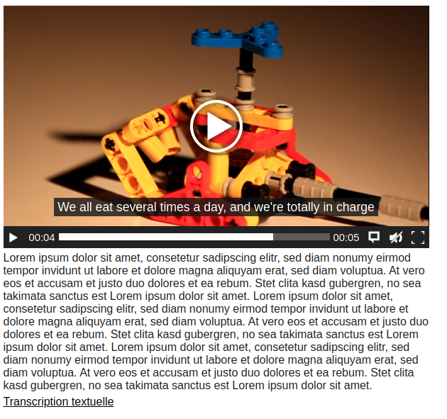

.. include:: ../Includes.txt

.. _introduction:

============
Introduction
============

What does it do?
================

This extension integrates the Vibeo project, an accessible media player based on MediaElement.js that is meant to respect the SGQRI standards of the provincial government of Quebec.

It supports all major video and audio formats, preview images, track files, and is able to fetch video files from Youtube and Vimeo.

Vibeo is developed and maintained by Libéo, this TYPO3 extension was built by Qc media.

Screenshots
===========

An example of a Vibeo player in a page

